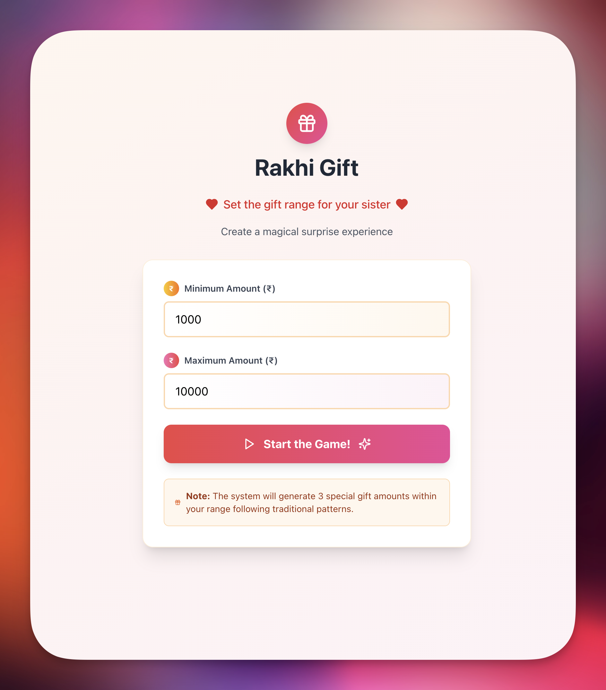
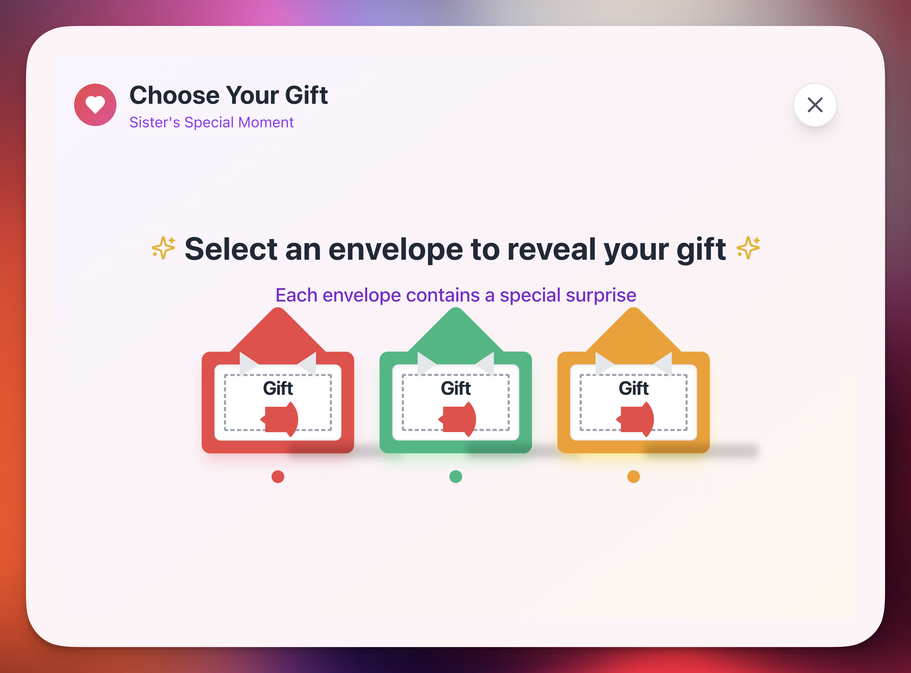
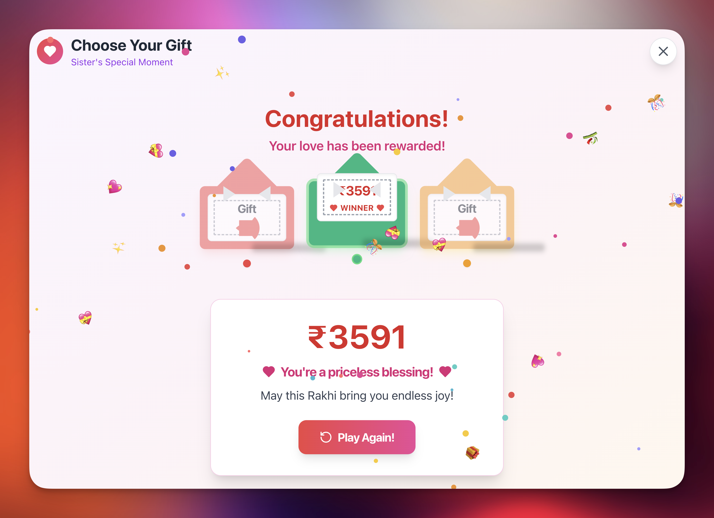

# Rakhi Gift PWA

A beautiful Progressive Web App for the Rakhi (Raksha Bandhan) festival that creates a fun gift-giving experience between brothers and sisters.

🔗 **Live Demo**: [https://rakhi-pwa.vercel.app/](https://rakhi-pwa.vercel.app/)

## Screenshots

### Setup Screen


### Play Screen


### Congratulations Screen


## Features

- **Gift Selection Game**: Brother sets min/max amounts, sister selects from 3 surprise envelopes
- **10n+1 Pattern**: All gift amounts follow the traditional pattern (1, 11, 21, 31, etc.)
- **Realistic Envelope Design**: Beautiful animated envelopes with card slide-out effects
- **Progressive Web App**: Optimized for mobile devices with offline support
- **Professional UI**: Clean, modern design with smooth animations

## Tech Stack

- **React 18** with TypeScript
- **Vite** for fast development and building
- **TailwindCSS** for styling
- **Motion** (Framer Motion successor) for animations
- **Lucide React** for professional icons

## Getting Started

### Prerequisites
- Node.js (version 16 or higher)
- npm or yarn

### Installation

1. Clone the repository
```bash
git clone <repository-url>
cd rakhi-pwa
```

2. Install dependencies
```bash
npm install
```

3. Start development server
```bash
npm run dev
```

4. Open your browser and navigate to `http://localhost:5173`

## How to Play

### Setup Mode (Brother)
1. Enter minimum gift amount
2. Enter maximum gift amount
3. Click "Start the Game!"

### Play Mode (Sister)
1. Choose one of the three envelopes
2. Watch the envelope open to reveal your gift amount
3. Enjoy the celebration animation!
4. Click "Play Again!" for a new round

## Project Structure

```
src/
├── components/
│   ├── EnvelopeCard.tsx    # Realistic envelope with animations
│   └── Confetti.tsx        # Celebration effects
├── context/
│   └── GiftContext.tsx     # State management
├── pages/
│   ├── SetupScreen.tsx     # Brother's setup interface
│   └── PlayScreen.tsx      # Sister's game interface
├── utils/
│   ├── generateValidGifts.ts # 10n+1 pattern logic
│   └── cn.ts               # Utility functions
└── App.tsx                 # Main application
```

## Build for Production

```bash
npm run build
```

The built files will be in the `dist` directory, ready for deployment.

## PWA Features

- **Installable**: Add to home screen on mobile devices
- **Offline Support**: Service worker for basic offline functionality
- **App-like Experience**: Standalone display mode
- **Custom Icons**: High-quality SVG and PNG icons
- **Responsive Design**: Optimized for mobile devices
- **Fast Loading**: Vite optimization and caching
- **Professional Interface**: Clean, modern design
- **Smooth Animations**: Fluid transitions and effects

### PWA Installation

The app can be installed on mobile devices:
1. **Android Chrome**: Look for "Add to Home Screen" prompt or menu option
2. **iOS Safari**: Use "Add to Home Screen" from share menu
3. **Desktop**: Install button may appear in address bar

### PWA Icons

The app uses multiple icon formats for best compatibility:
- `public/icon.svg` - Vector icon (scalable)
- `public/icon-192.png` - 192x192 PNG for Android
- `public/icon-512.png` - 512x512 PNG for larger displays

#### Updating PWA Icons

If you modify the SVG icon (`public/icon.svg`), you'll need to regenerate the PNG versions:

**Method 1: Using Node.js with sharp**
```bash
# Install sharp for high-quality image conversion
npm install -g sharp-cli

# Generate PNG icons from SVG
sharp -i public/icon.svg -o public/icon-192.png --resize 192
sharp -i public/icon.svg -o public/icon-512.png --resize 512
```

**Method 2: Using ImageMagick**
```bash
# Install ImageMagick (macOS)
brew install imagemagick

# Generate PNG icons
convert public/icon.svg -resize 192x192 public/icon-192.png
convert public/icon.svg -resize 512x512 public/icon-512.png
```

**Method 3: Using Inkscape**
```bash
# Install Inkscape (macOS)
brew install inkscape

# Generate PNG icons
inkscape public/icon.svg --export-png=public/icon-192.png --export-width=192 --export-height=192
inkscape public/icon.svg --export-png=public/icon-512.png --export-width=512 --export-height=512
```

**Method 4: Online Tools**
- Use [Convertio](https://convertio.co/svg-png/) or similar online converters
- Upload the SVG and download at 192x192 and 512x512 sizes

## Gift Amount Logic

The app generates gift amounts following the 10n+1 pattern:
- Valid amounts: 1, 11, 21, 31, 41, 51, etc.
- System selects 3 random valid amounts within the specified range
- Each envelope contains a different amount

## Contributing

1. Fork the repository
2. Create your feature branch (`git checkout -b feature/amazing-feature`)
3. Commit your changes (`git commit -m 'Add amazing feature'`)
4. Push to the branch (`git push origin feature/amazing-feature`)
5. Open a Pull Request

## License

This project is open source and available under the [MIT License](LICENSE).

---

Made with ❤️ for Raksha Bandhan celebrations